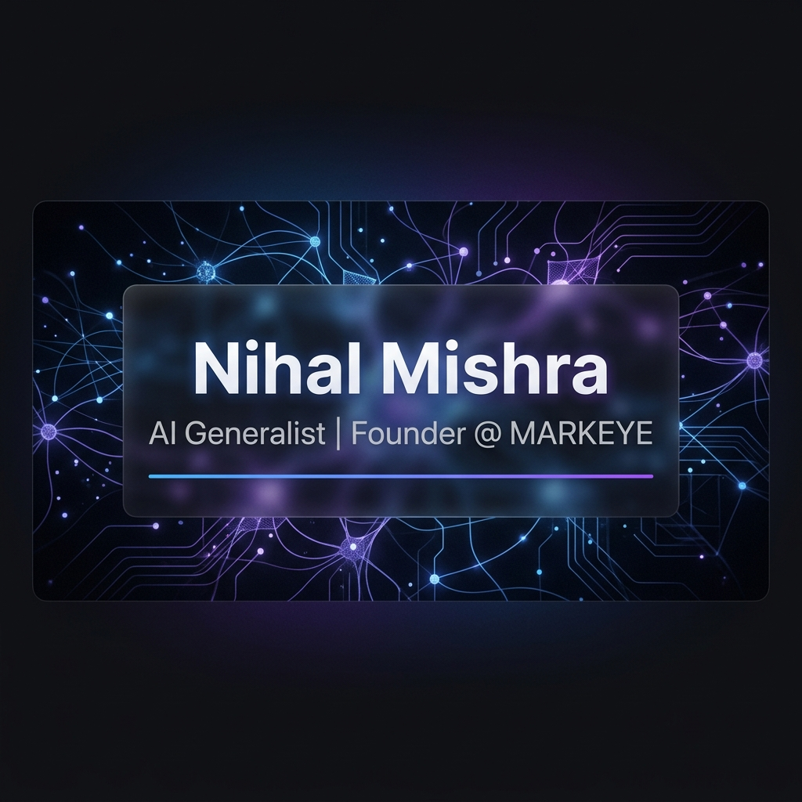

  
   
  
  <h1>🚀 AI Generalist & Founder @ <a href="https://markeye.space">MARKEYE</a></h1>
  
<b>Building Intelligent Business Solutions through Modern AI & Automation</b>

  
  
  
  

---

### 🚀 What I Do

I help enterprises and organizations **scale operations through custom AI automation systems**. 
With 50+ deployments across multiple industries, I transform complex workflows into intelligent, self-running systems.

- **AI Automation Agency (MARKEYE)**: Building high-ticket B2B automation solutions for healthcare, dental practices, and enterprise clients.
- **Fractional CTO Services**: AI systems architecture and implementation strategy.
- **Consulting**: Helping teams integrate AI/ML and DevOps into their core business.

---

### 🛠️ Tech Stack & Expertise

   
  
   
   
  
   
   
  

---

### 📊 GitHub Analytics

  
  

---

### 💼 Recent Wins

- **50+** Successful automation deployments across diverse sectors.
- Developed **enterprise-grade AI systems** for healthcare and SaaS companies.
- Built **scalable CI/CD pipelines** and automated cloud deployments.
- Created **custom AI agents** using n8n and Python for complex B2B lead generation.

 

  Let's build something intelligent together. ✨

